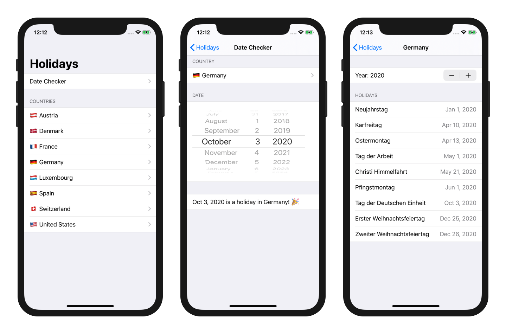

# SwiftyHolidays Example

This example project demonstrates how to use [SwiftyHolidays](https://github.com/MaxHaertwig/SwiftyHolidays), a library that hepls to determine whether a date is a holiday in a given country.

## Usage

Open [SwiftyHolidays-Example.xcodeproj](https://github.com/MaxHaertwig/SwiftyHolidays-Example/blob/master/SwiftyHolidays-Example.xcodeproj).

To run the app, select an iOS device or simulator and click _Run_.

## Requirements

This project is built with _SwiftUI_ using _Swift 5_.

Required:
- **Xcode 11** or later

Optional:
- **macOS 10.15** (Catalina) or later to see SwiftUI previews

## License

SwiftyHolidays Example is released under the MIT license. See [LICENSE](https://github.com/MaxHaertwig/SwiftyHolidays-Example/blob/master/LICENSE) for more information.
